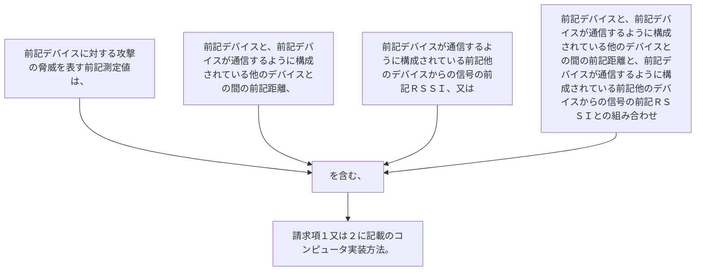

```mermaid
flowchart TD
A[前記デバイスに対する攻撃の脅威を表す前記測定値は、]
B[前記デバイスと、前記デバイスが通信するように構成されている他のデバイスとの間の前記距離、]
C[前記デバイスが通信するように構成されている前記他のデバイスからの信号の前記ＲＳＳＩ、又は]
D[前記デバイスと、前記デバイスが通信するように構成されている他のデバイスとの間の前記距離と、前記デバイスが通信するように構成されている前記他のデバイスからの信号の前記ＲＳＳＩとの組み合わせ]
E[を含む、]
F[請求項１又は２に記載のコンピュータ実装方法。]
A --> E
B --> E
C --> E
D --> E
E --> F
```