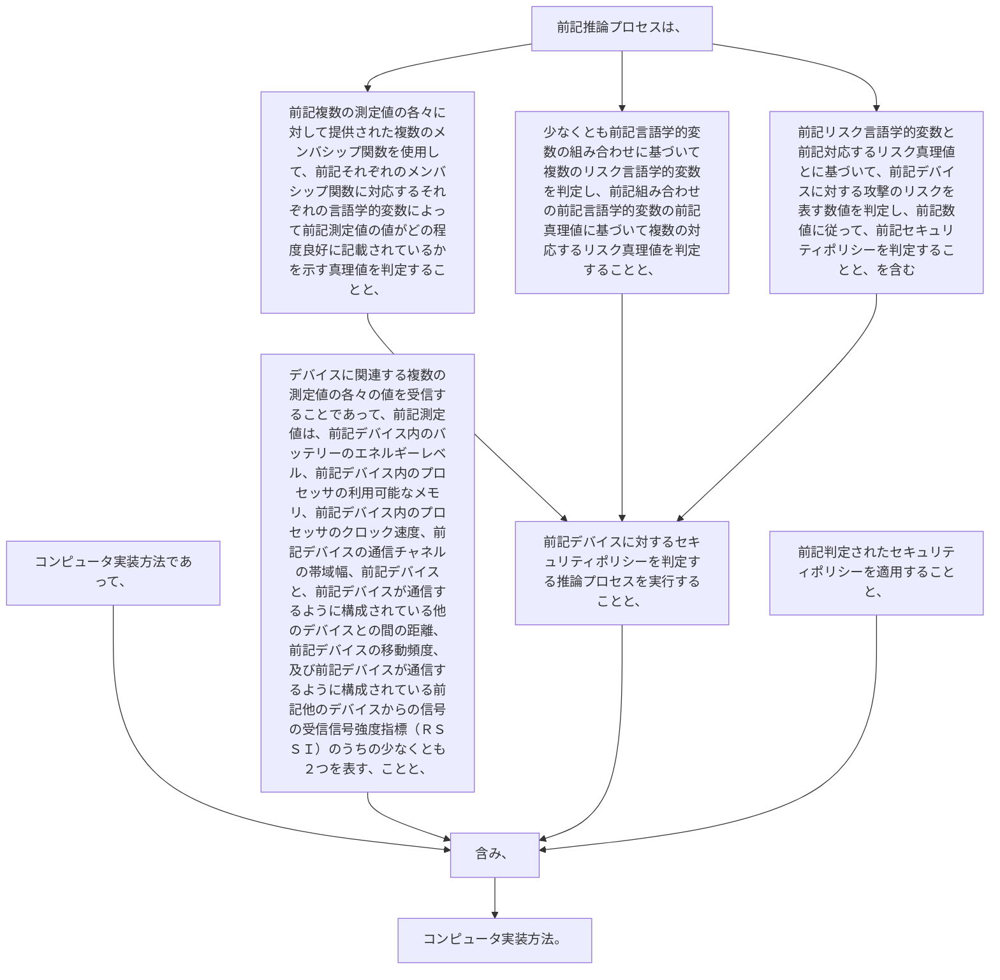

コンピュータ実装方法であって、
デバイスに関連する複数の測定値の各々の値を受信することであって、前記測定値は、
前記デバイス内のバッテリーのエネルギーレベル、
前記デバイス内のプロセッサの利用可能なメモリ、
前記デバイス内のプロセッサのクロック速度、
前記デバイスの通信チャネルの帯域幅、
前記デバイスと、前記デバイスが通信するように構成されている他のデバイスとの間の距離、
前記デバイスの移動頻度、及び
前記デバイスが通信するように構成されている前記他のデバイスからの信号の受信信号強度指標（ＲＳＳＩ）のうちの少なくとも２つを表す、ことと、
前記デバイスに対するセキュリティポリシーを判定する推論プロセスを実行することと、
前記判定されたセキュリティポリシーを適用することと、を含み、
前記推論プロセスは、
前記複数の測定値の各々に対して提供された複数のメンバシップ関数を使用して、前記それぞれのメンバシップ関数に対応するそれぞれの言語学的変数によって前記測定値の値がどの程度良好に記載されているかを示す真理値を判定することと、
少なくとも前記言語学的変数の組み合わせに基づいて複数のリスク言語学的変数を判定し、前記組み合わせの前記言語学的変数の前記真理値に基づいて複数の対応するリスク真理値を判定することと、
前記リスク言語学的変数と前記対応するリスク真理値とに基づいて、前記デバイスに対する攻撃のリスクを表す数値を判定し、前記数値に従って、前記セキュリティポリシーを判定することと、を含む、コンピュータ実装方法。
