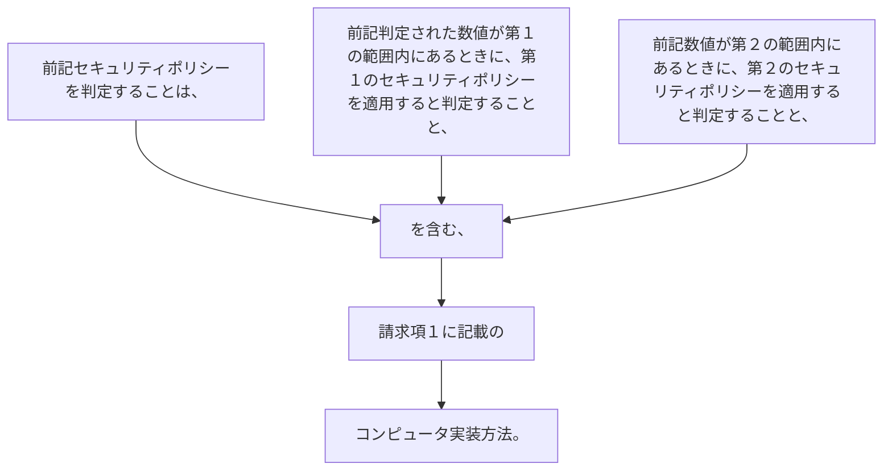

前記セキュリティポリシーを判定することは、前記判定された数値が第１の範囲内にあるときに、第１のセキュリティポリシーを適用すると判定することと、前記数値が第２の範囲内にあるときに、第２のセキュリティポリシーを適用すると判定することと、を含む、請求項１に記載のコンピュータ実装方法。

```mermaid
flowchart TD
A[前記セキュリティポリシーを判定することは、]
B[前記判定された数値が第１の範囲内にあるときに、第１のセキュリティポリシーを適用すると判定することと、]
C[前記数値が第２の範囲内にあるときに、第２のセキュリティポリシーを適用すると判定することと、]
D[を含む、]
E[請求項１に記載の]
F[コンピュータ実装方法。]
A --> D
B --> D
C --> D
D --> E
E --> F
```