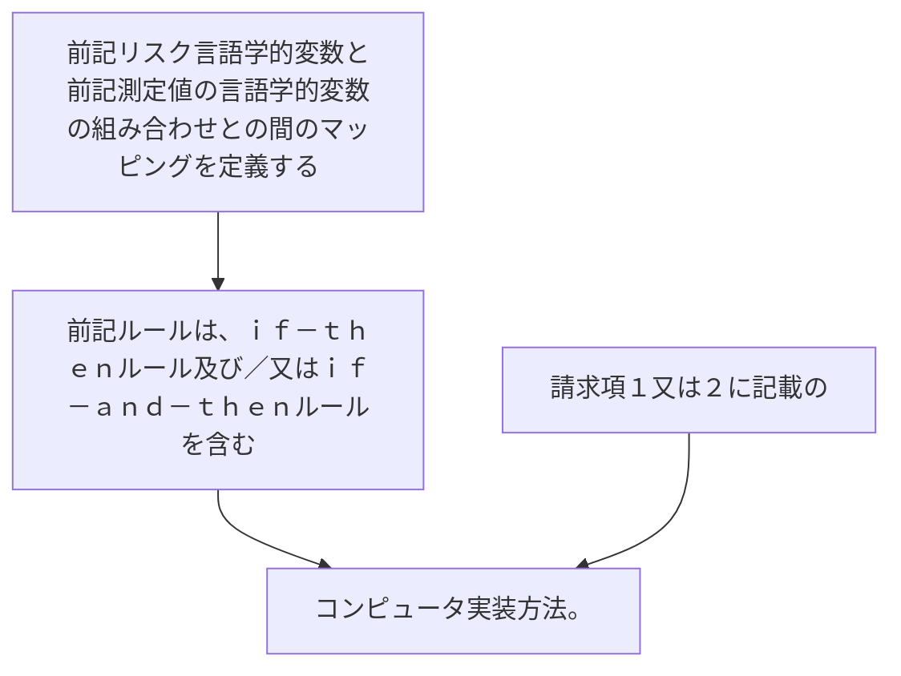

前記リスク言語学的変数と前記測定値の言語学的変数の組み合わせとの間のマッピングを定義する前記ルールは、ｉｆ－ｔｈｅｎルール及び／又はｉｆ－ａｎｄ－ｔｈｅｎルールを含む、請求項１又は２に記載のコンピュータ実装方法。

```mermaid
flowchart TD
A[前記リスク言語学的変数と前記測定値の言語学的変数の組み合わせとの間のマッピングを定義する]
B[前記ルールは、ｉｆ－ｔｈｅｎルール及び／又はｉｆ－ａｎｄ－ｔｈｅｎルールを含む]
C[請求項１又は２に記載の]
D[コンピュータ実装方法。]
A --> B
B --> D
C --> D
```