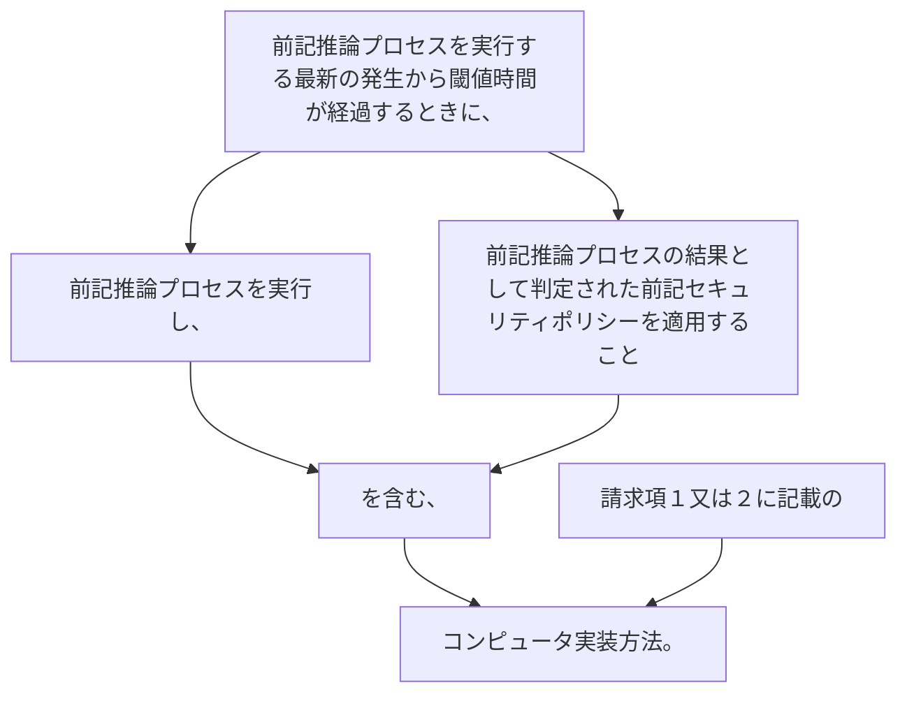

前記推論プロセスを実行する最新の発生から閾値時間が経過するときに、前記推論プロセスを実行し、前記推論プロセスの結果として判定された前記セキュリティポリシーを適用することを含む、請求項１又は２に記載のコンピュータ実装方法。

```mermaid
flowchart TD
A[前記推論プロセスを実行する最新の発生から閾値時間が経過するときに、]
B[前記推論プロセスを実行し、]
C[前記推論プロセスの結果として判定された前記セキュリティポリシーを適用すること]
D[を含む、]
E[請求項１又は２に記載の]
F[コンピュータ実装方法。]
A --> B
A --> C
B --> D
C --> D
D --> F
E --> F
```