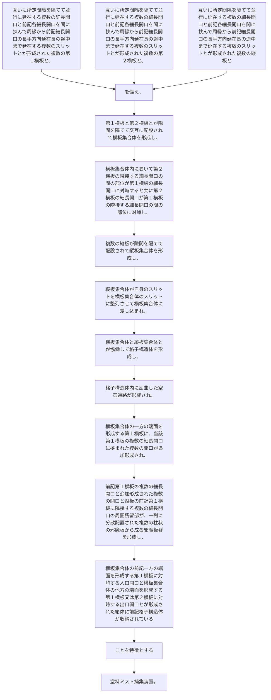

```mermaid
flowchart TD
A[互いに所定間隔を隔てて並行に延在する複数の細長開口と前記各細長開口を間に挟んで周縁から前記細長開口の長手方向延在長の途中まで延在する複数のスリットとが形成された複数の第１横板と、]
B[互いに所定間隔を隔てて並行に延在する複数の細長開口と前記各細長開口を間に挟んで周縁から前記細長開口の長手方向延在長の途中まで延在する複数のスリットとが形成された複数の第２横板と、]
C[互いに所定間隔を隔てて並行に延在する複数の細長開口と前記各細長開口を間に挟んで周縁から前記細長開口の長手方向延在長の途中まで延在する複数のスリットとが形成された複数の縦板と]
D[を備え、]
E[第１横板と第２横板とが隙間を隔てて交互に配設されて横板集合体を形成し、]
F[横板集合体内において第２横板の隣接する細長開口の間の部位が第１横板の細長開口に対峙すると共に第２横板の細長開口が第１横板の隣接する細長開口の間の部位に対峙し、]
G[複数の縦板が隙間を隔てて配設されて縦板集合体を形成し、]
H[縦板集合体が自身のスリットを横板集合体のスリットに整列させて横板集合体に差し込まれ、]
I[横板集合体と縦板集合体とが協働して格子構造体を形成し、]
J[格子構造体内に屈曲した空気通路が形成され、]
K[横板集合体の一方の端面を形成する第１横板に、当該第１横板の複数の細長開口に挟まれた複数の開口が追加形成され、]
L[前記第１横板の複数の細長開口と追加形成された複数の開口と縦板の前記第１横板に隣接する複数の細長開口の周囲残留部が、一列に分散配置された複数の柱状の邪魔板から成る邪魔板群を形成し、]
M[横板集合体の前記一方の端面を形成する第１横板に対峙する入口開口と横板集合体の他方の端面を形成する第１横板又は第２横板に対峙する出口開口とが形成された箱体に前記格子構造体が収納されている]
N[ことを特徴とする]
O[塗料ミスト捕集装置。]

A --> D
B --> D
C --> D
D --> E
E --> F
F --> G
G --> H
H --> I
I --> J
J --> K
K --> L
L --> M
M --> N
N --> O
```