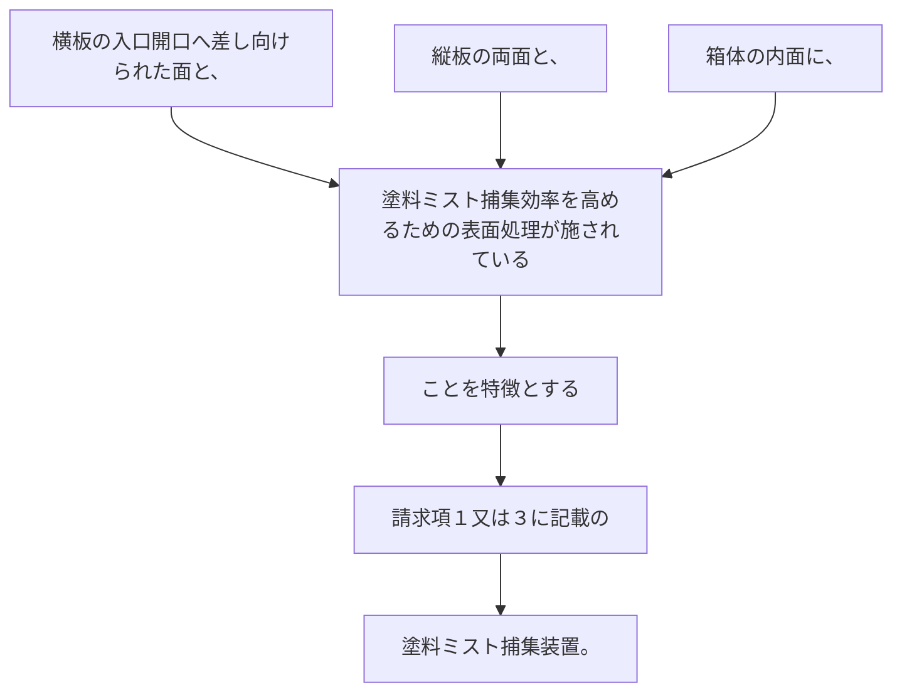

横板の入口開口へ差し向けられた面と、縦板の両面と、箱体の内面に、塗料ミスト捕集効率を高めるための表面処理が施されていることを特徴とする請求項１又は３に記載の塗料ミスト捕集装置。

```mermaid
flowchart TD
A[横板の入口開口へ差し向けられた面と、]
B[縦板の両面と、]
C[箱体の内面に、]
D[塗料ミスト捕集効率を高めるための表面処理が施されている]
E[ことを特徴とする]
F[請求項１又は３に記載の]
G[塗料ミスト捕集装置。]
A --> D
B --> D
C --> D
D --> E
E --> F
F --> G
```