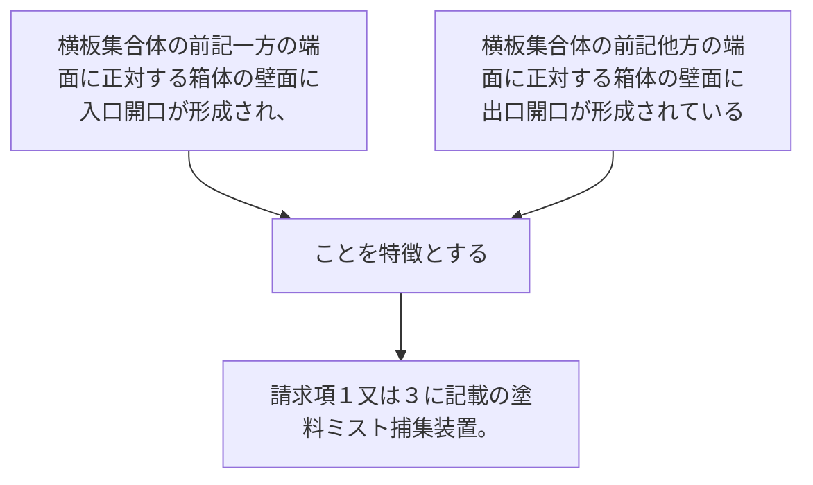

横板集合体の前記一方の端面に正対する箱体の壁面に入口開口が形成され、横板集合体の前記他方の端面に正対する箱体の壁面に出口開口が形成されていることを特徴とする請求項１又は３に記載の塗料ミスト捕集装置。

```mermaid
flowchart TD
A[横板集合体の前記一方の端面に正対する箱体の壁面に入口開口が形成され、]
B[横板集合体の前記他方の端面に正対する箱体の壁面に出口開口が形成されている]
C[ことを特徴とする]
D[請求項１又は３に記載の塗料ミスト捕集装置。]
A --> C
B --> C
C --> D
```