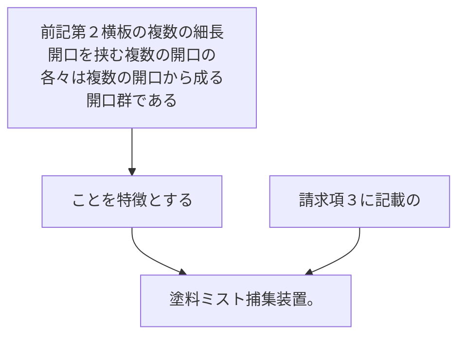

前記第２横板の複数の細長開口を挟む複数の開口の各々は複数の開口から成る開口群であることを特徴とする請求項３に記載の塗料ミスト捕集装置。

```mermaid
flowchart TD
A[前記第２横板の複数の細長開口を挟む複数の開口の各々は複数の開口から成る開口群である]
B[ことを特徴とする]
C[請求項３に記載の]
D[塗料ミスト捕集装置。]
A --> B
B --> D
C --> D
```