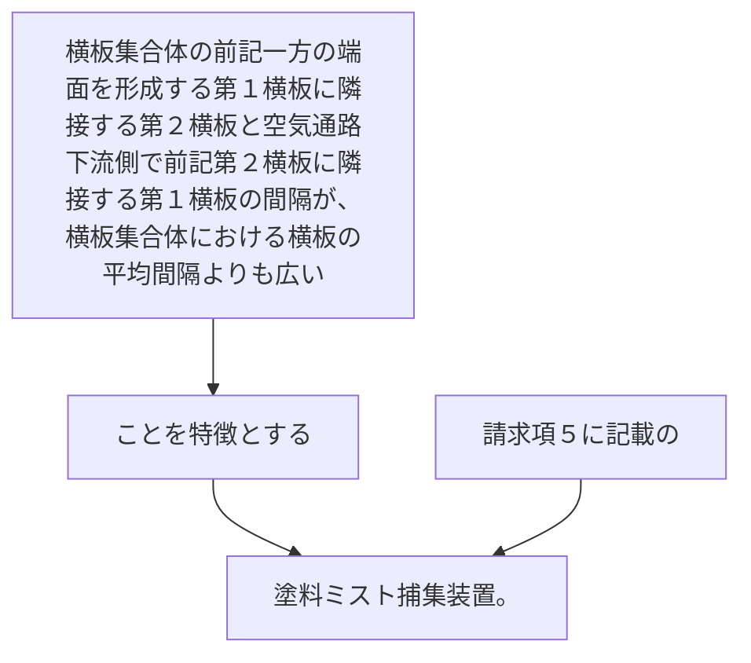

横板集合体の前記一方の端面を形成する第１横板に隣接する第２横板と空気通路下流側で前記第２横板に隣接する第１横板の間隔が、横板集合体における横板の平均間隔よりも広いことを特徴とする請求項５に記載の塗料ミスト捕集装置。

```mermaid
flowchart TD
A[横板集合体の前記一方の端面を形成する第１横板に隣接する第２横板と空気通路下流側で前記第２横板に隣接する第１横板の間隔が、横板集合体における横板の平均間隔よりも広い]
B[ことを特徴とする]
C[請求項５に記載の]
D[塗料ミスト捕集装置。]
A --> B
B --> D
C --> D
```