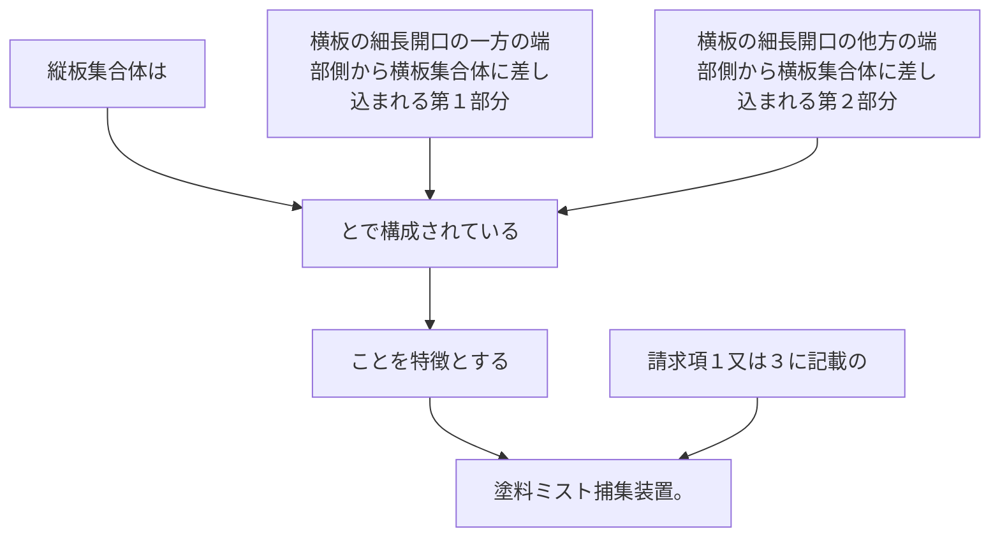

縦板集合体は横板の細長開口の一方の端部側から横板集合体に差し込まれる第１部分と、横板の細長開口の他方の端部側から横板集合体に差し込まれる第２部分とで構成されていることを特徴とする請求項１又は３に記載の塗料ミスト捕集装置。

```mermaid
flowchart TD
A[縦板集合体は]
B[横板の細長開口の一方の端部側から横板集合体に差し込まれる第１部分]
C[横板の細長開口の他方の端部側から横板集合体に差し込まれる第２部分]
D[とで構成されている]
E[ことを特徴とする]
F[請求項１又は３に記載の]
G[塗料ミスト捕集装置。]
A --> D
B --> D
C --> D
D --> E
E --> G
F --> G
```