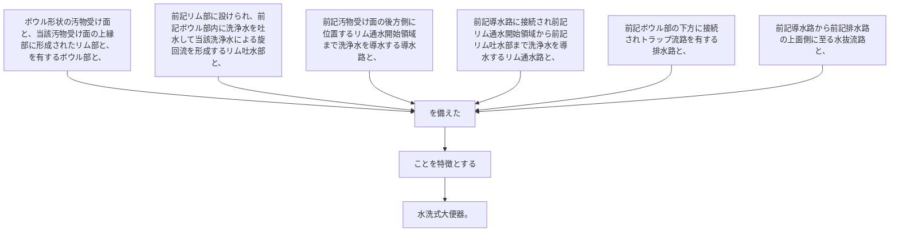

```mermaid
flowchart TD
A[ボウル形状の汚物受け面と、当該汚物受け面の上縁部に形成されたリム部と、を有するボウル部と、]
B[前記リム部に設けられ、前記ボウル部内に洗浄水を吐水して当該洗浄水による旋回流を形成するリム吐水部と、]
C[前記汚物受け面の後方側に位置するリム通水開始領域まで洗浄水を導水する導水路と、]
D[前記導水路に接続され前記リム通水開始領域から前記リム吐水部まで洗浄水を導水するリム通水路と、]
E[前記ボウル部の下方に接続されトラップ流路を有する排水路と、]
F[前記導水路から前記排水路の上面側に至る水抜流路と、]
G[を備えた]
H[ことを特徴とする]
I[水洗式大便器。]

A --> G
B --> G
C --> G
D --> G
E --> G
F --> G
G --> H
H --> I
```