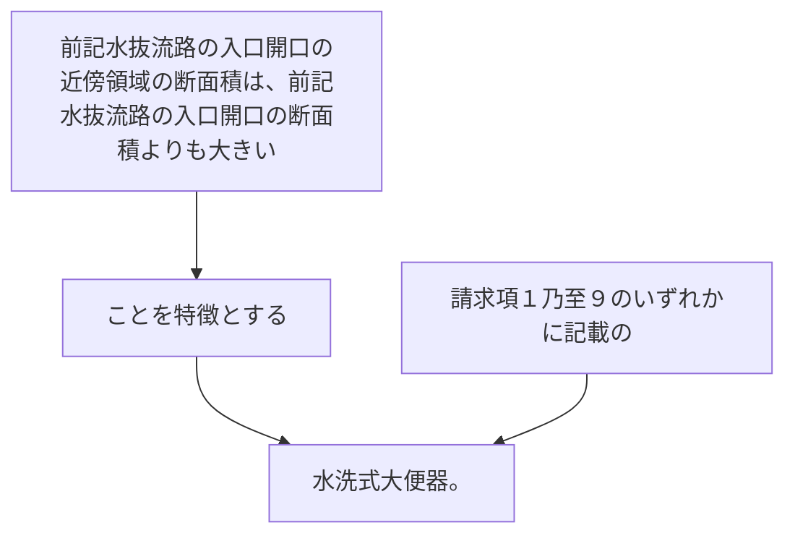

前記水抜流路の入口開口の近傍領域の断面積は、前記水抜流路の入口開口の断面積よりも大きい
ことを特徴とする請求項１乃至９のいずれかに記載の水洗式大便器。

```mermaid
flowchart TD
A[前記水抜流路の入口開口の近傍領域の断面積は、前記水抜流路の入口開口の断面積よりも大きい]
B[ことを特徴とする]
C[請求項１乃至９のいずれかに記載の]
D[水洗式大便器。]
A --> B
B --> D
C --> D
```