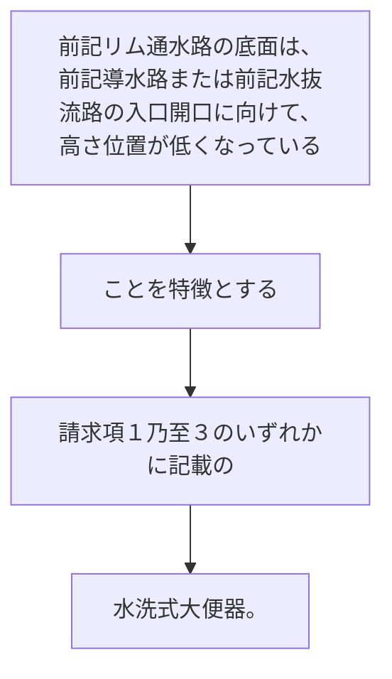

前記リム通水路の底面は、前記導水路または前記水抜流路の入口開口に向けて、高さ位置が低くなっている
ことを特徴とする請求項１乃至３のいずれかに記載の水洗式大便器。

```mermaid
flowchart TD
A[前記リム通水路の底面は、前記導水路または前記水抜流路の入口開口に向けて、高さ位置が低くなっている]
B[ことを特徴とする]
C[請求項１乃至３のいずれかに記載の]
D[水洗式大便器。]
A --> B
B --> C
C --> D
```