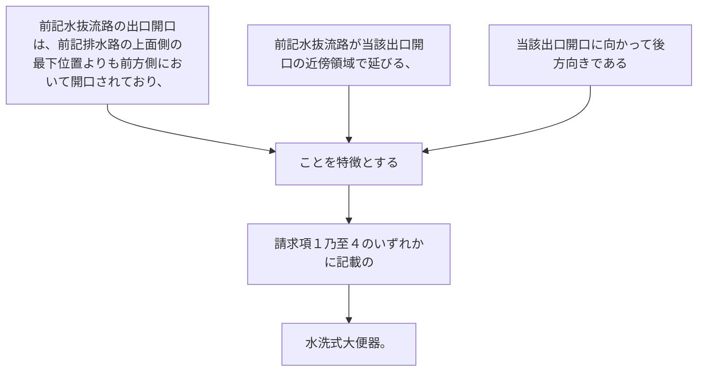

```mermaid
flowchart TD
A[前記水抜流路の出口開口は、前記排水路の上面側の最下位置よりも前方側において開口されており、]
B[前記水抜流路が当該出口開口の近傍領域で延びる、]
C[当該出口開口に向かって後方向きである]
D[ことを特徴とする]
E[請求項１乃至４のいずれかに記載の]
F[水洗式大便器。]
A --> D
B --> D
C --> D
D --> E
E --> F
```