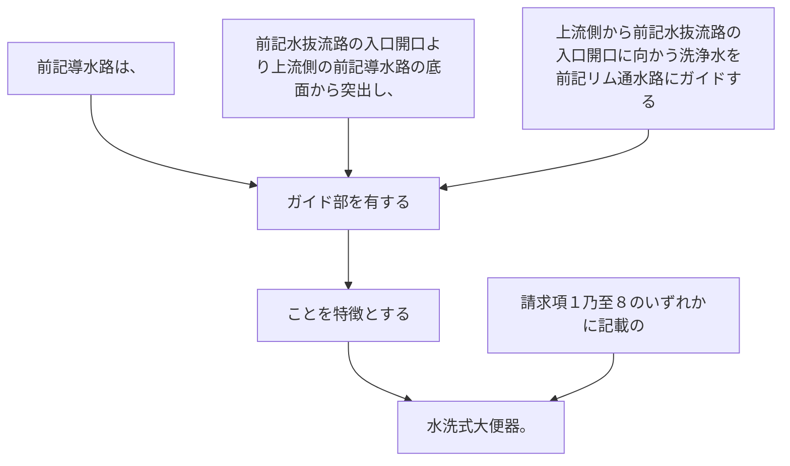

前記導水路は、前記水抜流路の入口開口より上流側の前記導水路の底面から突出し、上流側から前記水抜流路の入口開口に向かう洗浄水を前記リム通水路にガイドするガイド部を有する
ことを特徴とする請求項１乃至８のいずれかに記載の水洗式大便器。

```mermaid
flowchart TD
A[前記導水路は、]
B[前記水抜流路の入口開口より上流側の前記導水路の底面から突出し、]
C[上流側から前記水抜流路の入口開口に向かう洗浄水を前記リム通水路にガイドする]
D[ガイド部を有する]
E[ことを特徴とする]
F[請求項１乃至８のいずれかに記載の]
G[水洗式大便器。]

A --> D
B --> D
C --> D
D --> E
E --> G
F --> G
```