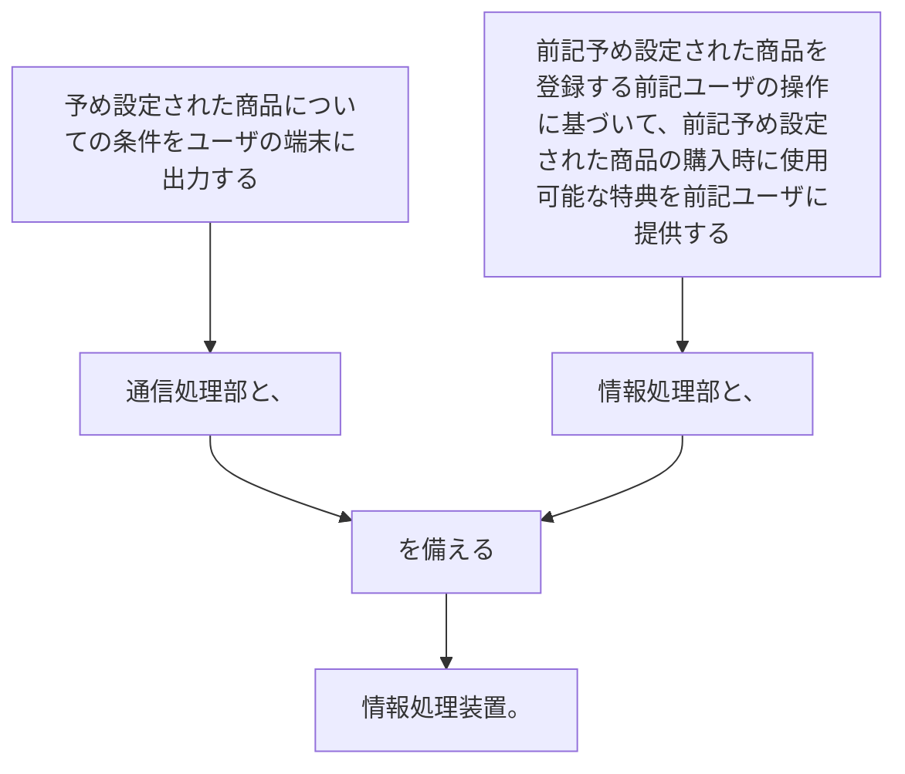

```mermaid
flowchart TD
A[予め設定された商品についての条件をユーザの端末に出力する]
B[通信処理部と、]
C[前記予め設定された商品を登録する前記ユーザの操作に基づいて、前記予め設定された商品の購入時に使用可能な特典を前記ユーザに提供する]
D[情報処理部と、]
E[を備える]
F[情報処理装置。]
A --> B
C --> D
B --> E
D --> E
E --> F
```