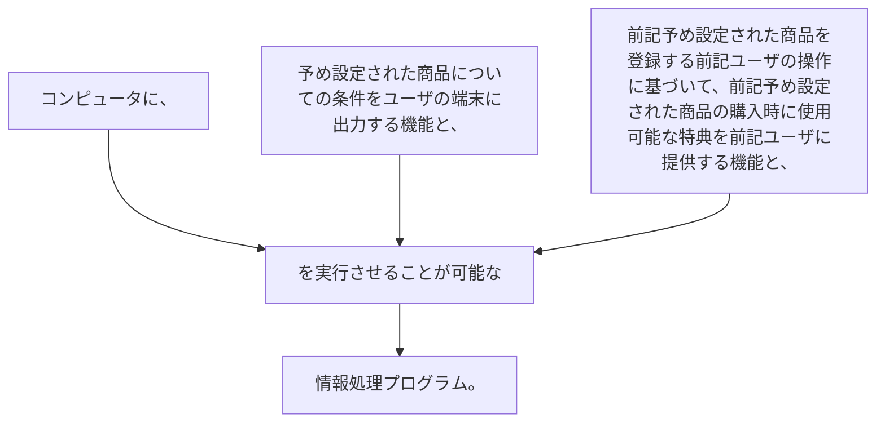

コンピュータに、
予め設定された商品についての条件をユーザの端末に出力する機能と、
前記予め設定された商品を登録する前記ユーザの操作に基づいて、前記予め設定された商品の購入時に使用可能な特典を前記ユーザに提供する機能と、
を実行させることが可能な情報処理プログラム。

```mermaid
flowchart TD
A[コンピュータに、]
B[予め設定された商品についての条件をユーザの端末に出力する機能と、]
C[前記予め設定された商品を登録する前記ユーザの操作に基づいて、前記予め設定された商品の購入時に使用可能な特典を前記ユーザに提供する機能と、]
D[を実行させることが可能な]
E[情報処理プログラム。]
A --> D
B --> D
C --> D
D --> E
```