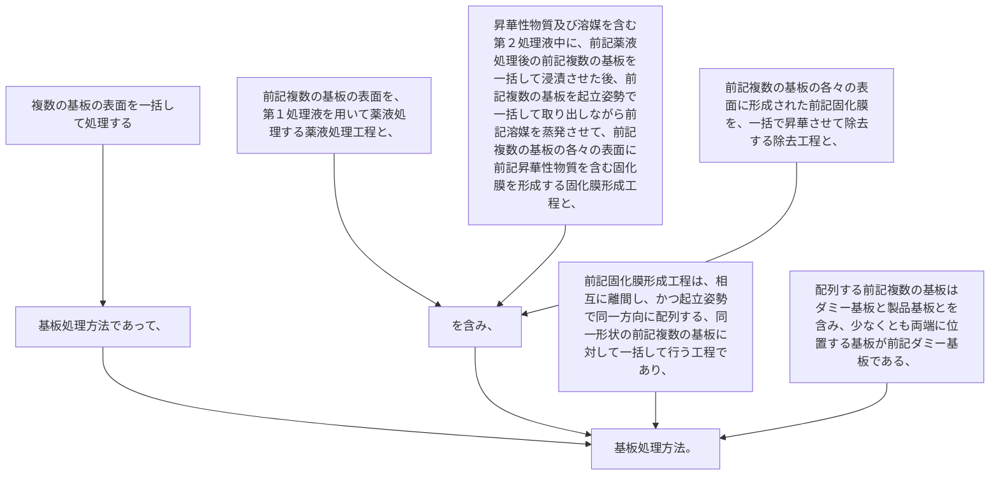

複数の基板の表面を一括して処理する基板処理方法であって、
前記複数の基板の表面を、第１処理液を用いて薬液処理する薬液処理工程と、
昇華性物質及び溶媒を含む第２処理液中に、前記薬液処理後の前記複数の基板を一括して浸漬させた後、前記複数の基板を起立姿勢で一括して取り出しながら前記溶媒を蒸発させて、前記複数の基板の各々の表面に前記昇華性物質を含む固化膜を形成する固化膜形成工程と、
前記複数の基板の各々の表面に形成された前記固化膜を、一括で昇華させて除去する除去工程と、
を含み、
前記固化膜形成工程は、相互に離間し、かつ起立姿勢で同一方向に配列する、同一形状の前記複数の基板に対して一括して行う工程であり、
配列する前記複数の基板はダミー基板と製品基板とを含み、少なくとも両端に位置する基板が前記ダミー基板である、基板処理方法。
