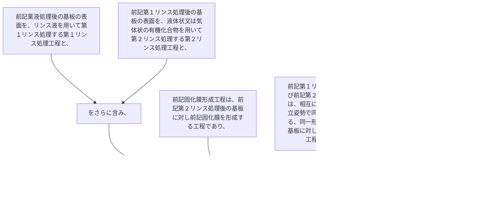

前記薬液処理後の基板の表面を、リンス液を用いて第１リンス処理する第１リンス処理工程と、
前記第１リンス処理後の基板の表面を、液体状又は気体状の有機化合物を用いて第２リンス処理する第２リンス処理工程と、
をさらに含み、
前記固化膜形成工程は、前記第２リンス処理後の基板に対し前記固化膜を形成する工程であり、
前記第１リンス処理工程及び前記第２リンス処理工程は、相互に離間し、かつ起立姿勢で同一方向に配列する、同一形状の前記複数の基板に対して一括して行う工程であり、
前記第１リンス処理工程及び前記第２リンス処理工程に於いて、配列する前記複数の基板はダミー基板と製品基板とを含み、少なくとも両端に位置する前記基板が前記ダミー基板である、請求項１に記載の基板処理方法。
