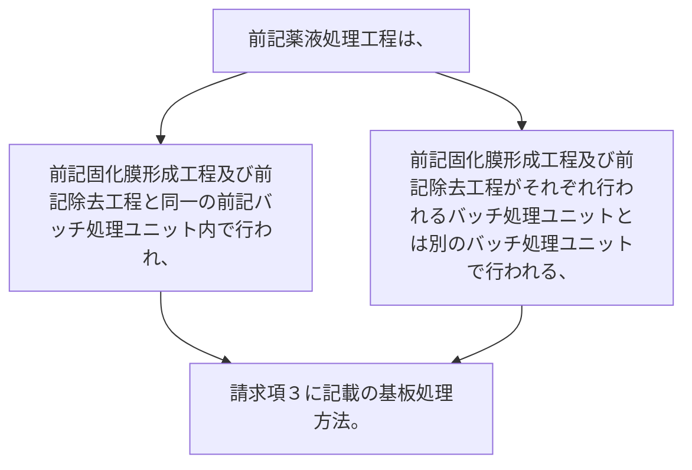

前記薬液処理工程は、
前記固化膜形成工程及び前記除去工程と同一の前記バッチ処理ユニット内で行われ、
又は、前記固化膜形成工程及び前記除去工程がそれぞれ行われるバッチ処理ユニットとは別のバッチ処理ユニットで行われる、請求項３に記載の基板処理方法。

```mermaid
flowchart TD
A[前記薬液処理工程は、]
B[前記固化膜形成工程及び前記除去工程と同一の前記バッチ処理ユニット内で行われ、]
C[前記固化膜形成工程及び前記除去工程がそれぞれ行われるバッチ処理ユニットとは別のバッチ処理ユニットで行われる、]
D[請求項３に記載の基板処理方法。]
A --> B
A --> C
B --> D
C --> D
```