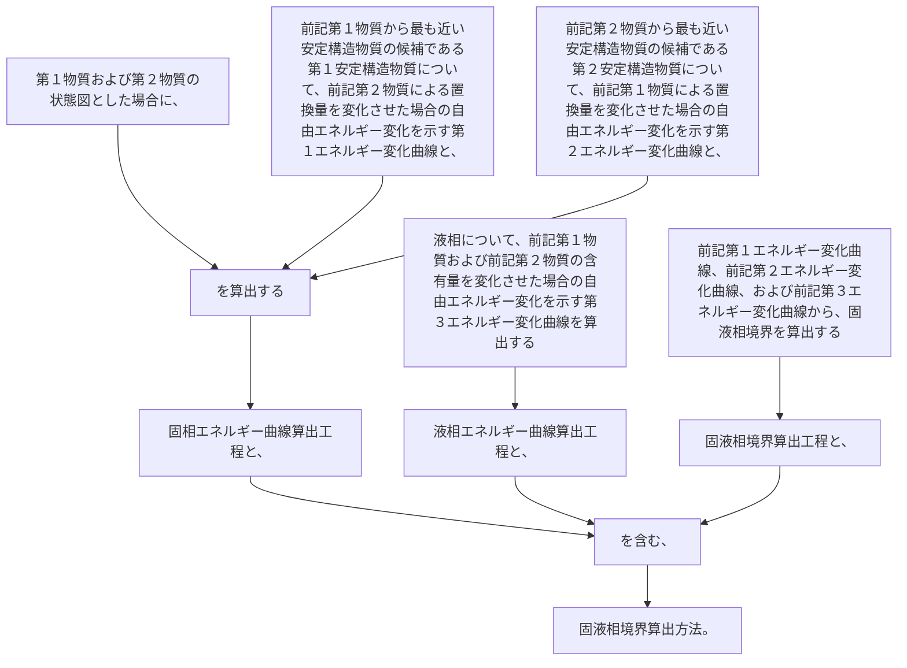

```mermaid
flowchart TD
A[第１物質および第２物質の状態図とした場合に、]
B[前記第１物質から最も近い安定構造物質の候補である第１安定構造物質について、前記第２物質による置換量を変化させた場合の自由エネルギー変化を示す第１エネルギー変化曲線と、]
C[前記第２物質から最も近い安定構造物質の候補である第２安定構造物質について、前記第１物質による置換量を変化させた場合の自由エネルギー変化を示す第２エネルギー変化曲線と、]
D[を算出する]
E[固相エネルギー曲線算出工程と、]
F[液相について、前記第１物質および前記第２物質の含有量を変化させた場合の自由エネルギー変化を示す第３エネルギー変化曲線を算出する]
G[液相エネルギー曲線算出工程と、]
H[前記第１エネルギー変化曲線、前記第２エネルギー変化曲線、および前記第３エネルギー変化曲線から、固液相境界を算出する]
I[固液相境界算出工程と、]
J[を含む、]
K[固液相境界算出方法。]
A --> D
B --> D
C --> D
D --> E
E --> J
F --> G
G --> J
H --> I
I --> J
J --> K
```