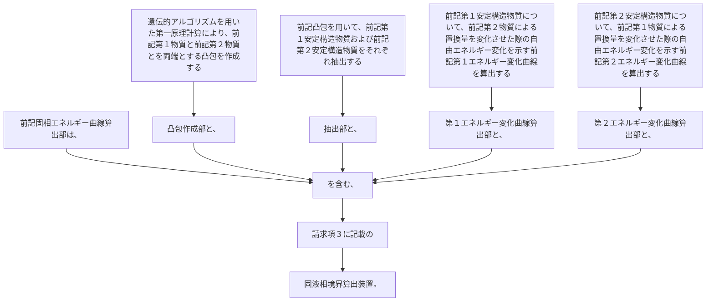

```mermaid
flowchart TD
A[前記固相エネルギー曲線算出部は、]
B[遺伝的アルゴリズムを用いた第一原理計算により、前記第１物質と前記第２物質とを両端とする凸包を作成する]
C[凸包作成部と、]
D[前記凸包を用いて、前記第１安定構造物質および前記第２安定構造物質をそれぞれ抽出する]
E[抽出部と、]
F[前記第１安定構造物質について、前記第２物質による置換量を変化させた際の自由エネルギー変化を示す前記第１エネルギー変化曲線を算出する]
G[第１エネルギー変化曲線算出部と、]
H[前記第２安定構造物質について、前記第１物質による置換量を変化させた際の自由エネルギー変化を示す前記第２エネルギー変化曲線を算出する]
I[第２エネルギー変化曲線算出部と、]
J[を含む、]
K[請求項３に記載の]
L[固液相境界算出装置。]
A --> J
B --> C
D --> E
F --> G
H --> I
C --> J
E --> J
G --> J
I --> J
J --> K
K --> L
```