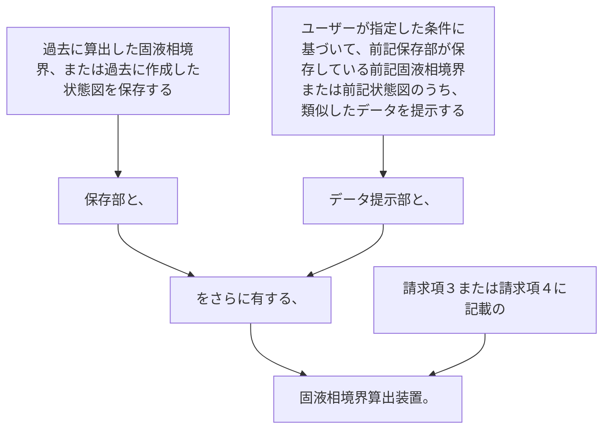

```mermaid
flowchart TD
A[過去に算出した固液相境界、または過去に作成した状態図を保存する]
B[保存部と、]
C[ユーザーが指定した条件に基づいて、前記保存部が保存している前記固液相境界または前記状態図のうち、類似したデータを提示する]
D[データ提示部と、]
E[をさらに有する、]
F[請求項３または請求項４に記載の]
G[固液相境界算出装置。]
A --> B
C --> D
B --> E
D --> E
E --> G
F --> G
```