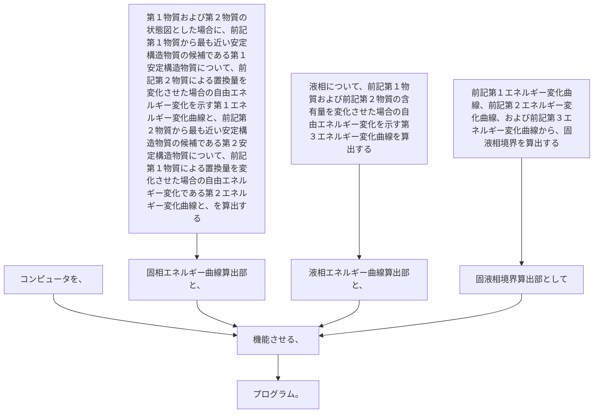

コンピュータを、
第１物質および第２物質の状態図とした場合に、前記第１物質から最も近い安定構造物質の候補である第１安定構造物質について、前記第２物質による置換量を変化させた場合の自由エネルギー変化を示す第１エネルギー変化曲線と、前記第２物質から最も近い安定構造物質の候補である第２安定構造物質について、前記第１物質による置換量を変化させた場合の自由エネルギー変化である第２エネルギー変化曲線と、を算出する固相エネルギー曲線算出部と、
液相について、前記第１物質および前記第２物質の含有量を変化させた場合の自由エネルギー変化を示す第３エネルギー変化曲線を算出する液相エネルギー曲線算出部と、
前記第１エネルギー変化曲線、前記第２エネルギー変化曲線、および前記第３エネルギー変化曲線から、固液相境界を算出する固液相境界算出部として機能させる、プログラム。
