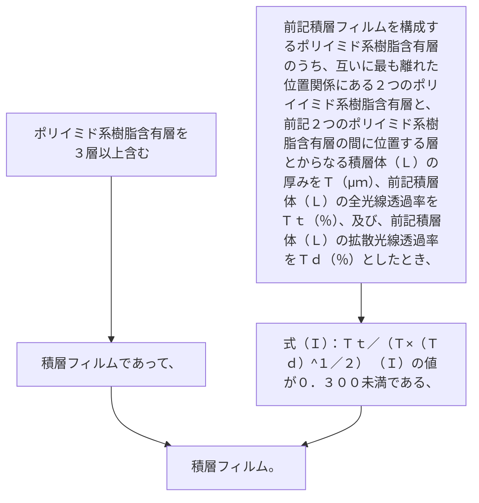

ポリイミド系樹脂含有層を３層以上含む積層フィルムであって、
前記積層フィルムを構成するポリイミド系樹脂含有層のうち、互いに最も離れた位置関係にある２つのポリイミド系樹脂含有層と、前記２つのポリイミド系樹脂含有層の間に位置する層とからなる積層体（Ｌ）の厚みをＴ（μｍ）、前記積層体（Ｌ）の全光線透過率をＴｔ（％）、及び、前記積層体（Ｌ）の拡散光線透過率をＴｄ（％）としたとき、式（Ｉ）：
Ｔｔ／（Ｔ×（Ｔｄ）
^１／２
）      （Ｉ）
の値が０．３００未満である、積層フィルム。
