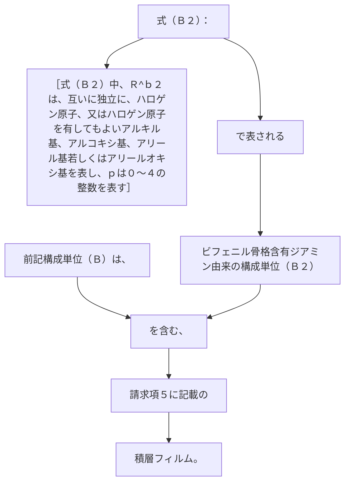

前記構成単位（Ｂ）は、式（Ｂ２）：
［式（Ｂ２）中、Ｒ
^ｂ２
は、互いに独立に、ハロゲン原子、又はハロゲン原子を有してもよいアルキル基、アルコキシ基、アリール基若しくはアリールオキシ基を表し、
ｐは０～４の整数を表す］
で表されるビフェニル骨格含有ジアミン由来の構成単位（Ｂ２）を含む、請求項５に記載の積層フィルム。

```mermaid
flowchart TD
A[前記構成単位（Ｂ）は、]
B[式（Ｂ２）：]
C[［式（Ｂ２）中、Ｒ^ｂ２は、互いに独立に、ハロゲン原子、又はハロゲン原子を有してもよいアルキル基、アルコキシ基、アリール基若しくはアリールオキシ基を表し、ｐは０～４の整数を表す］]
D[で表される]
E[ビフェニル骨格含有ジアミン由来の構成単位（Ｂ２）]
F[を含む、]
G[請求項５に記載の]
H[積層フィルム。]

A --> F
B --> C
B --> D
D --> E
E --> F
F --> G
G --> H
```