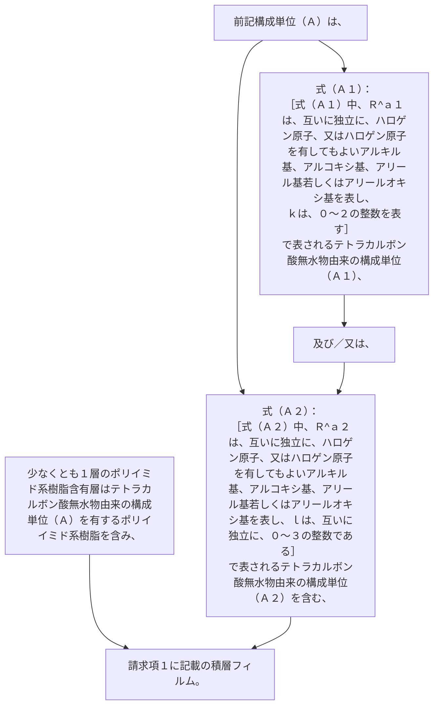

```mermaid
flowchart TD
N1[少なくとも１層のポリイミド系樹脂含有層はテトラカルボン酸無水物由来の構成単位（Ａ）を有するポリイイミド系樹脂を含み、]
N2[前記構成単位（Ａ）は、]
N3[式（Ａ１）：<br/>［式（Ａ１）中、Ｒ^ａ１は、互いに独立に、ハロゲン原子、又はハロゲン原子を有してもよいアルキル基、アルコキシ基、アリール基若しくはアリールオキシ基を表し、<br/>ｋは、０～２の整数を表す］<br/>で表されるテトラカルボン酸無水物由来の構成単位（Ａ１）、]
N4[及び／又は、]
N5[式（Ａ２）：<br/>［式（Ａ２）中、Ｒ^ａ２は、互いに独立に、ハロゲン原子、又はハロゲン原子を有してもよいアルキル基、アルコキシ基、アリール基若しくはアリールオキシ基を表し、ｌは、互いに独立に、０～３の整数である］<br/>で表されるテトラカルボン酸無水物由来の構成単位（Ａ２）を含む、]
N6[請求項１に記載の積層フィルム。]

N1 --> N6
N2 --> N3
N2 --> N5
N3 --> N4
N4 --> N5
N5 --> N6
```