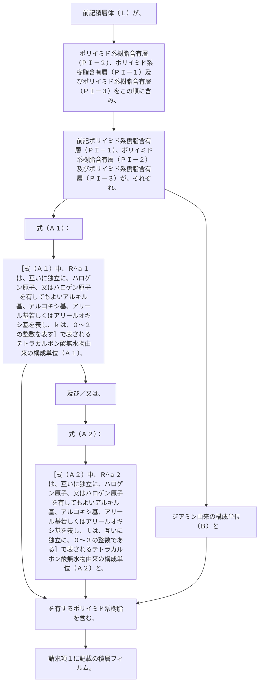

前記積層体（Ｌ）が、ポリイミド系樹脂含有層（ＰＩ－２）、ポリイミド系樹脂含有層（ＰＩ－１）及びポリイミド系樹脂含有層（ＰＩ－３）をこの順に含み、前記ポリイミド系樹脂含有層（ＰＩ－１）、ポリイミド系樹脂含有層（ＰＩ－２）及びポリイミド系樹脂含有層（ＰＩ－３）が、それぞれ、式（Ａ１）：
［式（Ａ１）中、Ｒ
^ａ１
は、互いに独立に、ハロゲン原子、又はハロゲン原子を有してもよいアルキル基、アルコキシ基、アリール基若しくはアリールオキシ基を表し、
ｋは、０～２の整数を表す］
で表されるテトラカルボン酸無水物由来の構成単位（Ａ１）、及び／又は、式（Ａ２）：
［式（Ａ２）中、Ｒ
^ａ２
は、互いに独立に、ハロゲン原子、又はハロゲン原子を有してもよいアルキル基、アルコキシ基、アリール基若しくはアリールオキシ基を表し、ｌは、互いに独立に、０～３の整数である］
で表されるテトラカルボン酸無水物由来の構成単位（Ａ２）と、ジアミン由来の構成単位（Ｂ）とを有するポリイミド系樹脂を含む、請求項１に記載の積層フィルム。
