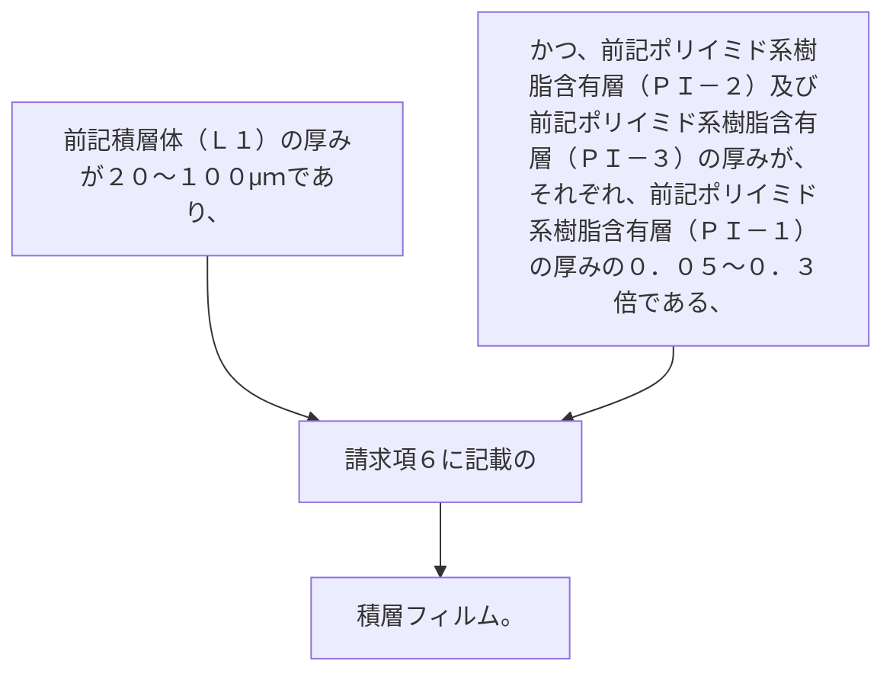

前記積層体（Ｌ１）の厚みが２０～１００μｍであり、かつ、前記ポリイミド系樹脂含有層（ＰＩ－２）及び前記ポリイミド系樹脂含有層（ＰＩ－３）の厚みが、それぞれ、前記ポリイミド系樹脂含有層（ＰＩ－１）の厚みの０．０５～０．３倍である、請求項６に記載の積層フィルム。

```mermaid
flowchart TD
A[前記積層体（Ｌ１）の厚みが２０～１００μｍであり、]
B[かつ、前記ポリイミド系樹脂含有層（ＰＩ－２）及び前記ポリイミド系樹脂含有層（ＰＩ－３）の厚みが、それぞれ、前記ポリイミド系樹脂含有層（ＰＩ－１）の厚みの０．０５～０．３倍である、]
C[請求項６に記載の]
D[積層フィルム。]
A --> C
B --> C
C --> D
```