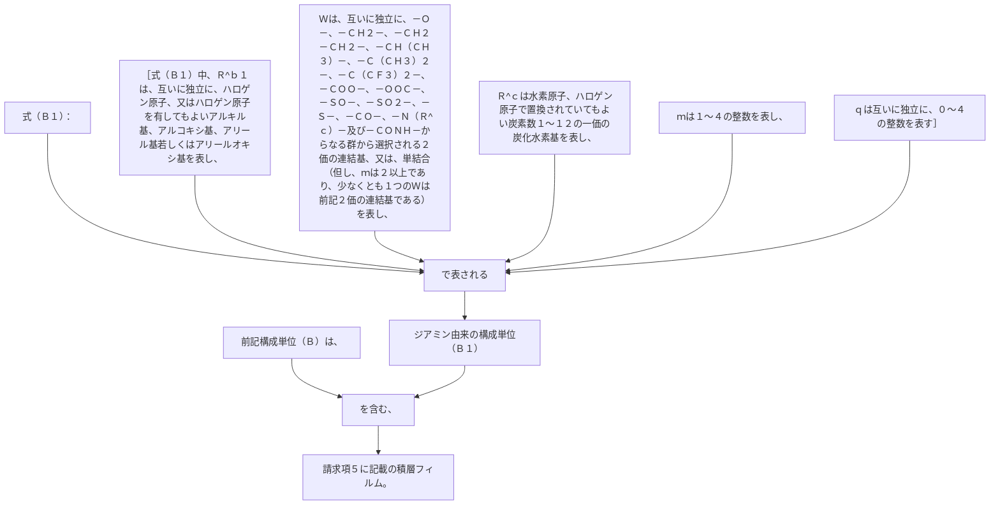

前記構成単位（Ｂ）は、式（Ｂ１）：
［式（Ｂ１）中、Ｒ
^ｂ１
は、互いに独立に、ハロゲン原子、又はハロゲン原子を有してもよいアルキル基、アルコキシ基、アリール基若しくはアリールオキシ基を表し、
Ｗは、互いに独立に、－Ｏ－、－ＣＨ
２
－、－ＣＨ
２
－ＣＨ
２
－、－ＣＨ（ＣＨ
３
）－、－Ｃ（ＣＨ
３
）
２
－、－Ｃ（ＣＦ
３
）
２
－、－ＣＯＯ－、－ＯＯＣ－、－ＳＯ－、－ＳＯ
２
－、－Ｓ－、－ＣＯ－、－Ｎ（Ｒ
^ｃ
）－及び－ＣＯＮＨ－からなる群から選択される２価の連結基、又は、単結合（但し、ｍは２以上であり、少なくとも１つのＷは前記２価の連結基である）を表し、Ｒ
^ｃ
は水素原子、ハロゲン原子で置換されていてもよい炭素数１～１２の一価の炭化水素基を表し、
ｍは１～４の整数を表し、
ｑは互いに独立に、０～４の整数を表す］
で表されるジアミン由来の構成単位（Ｂ１）を含む、請求項５に記載の積層フィルム。
