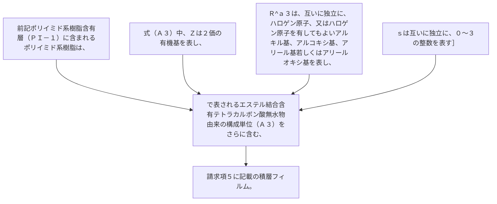

前記ポリイミド系樹脂含有層（ＰＩ－１）に含まれるポリイミド系樹脂は、式（Ａ３）：
［式（Ａ３）中、Ｚは２価の有機基を表し、
Ｒ
^ａ３
は、互いに独立に、ハロゲン原子、又はハロゲン原子を有してもよいアルキル基、アルコキシ基、アリール基若しくはアリールオキシ基を表し、
ｓは互いに独立に、０～３の整数を表す］
で表されるエステル結合含有テトラカルボン酸無水物由来の構成単位（Ａ３）をさらに含む、請求項５に記載の積層フィルム。
