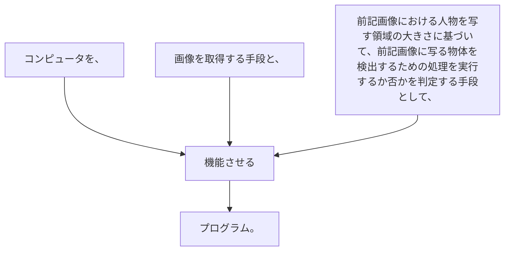

コンピュータを、
画像を取得する手段と、
前記画像における人物を写す領域の大きさに基づいて、前記画像に写る物体を検出するための処理を実行するか否かを判定する手段として、機能させるプログラム。

```mermaid
flowchart TD
A[コンピュータを、]
B[画像を取得する手段と、]
C[前記画像における人物を写す領域の大きさに基づいて、前記画像に写る物体を検出するための処理を実行するか否かを判定する手段として、]
D[機能させる]
E[プログラム。]
A --> D
B --> D
C --> D
D --> E
```