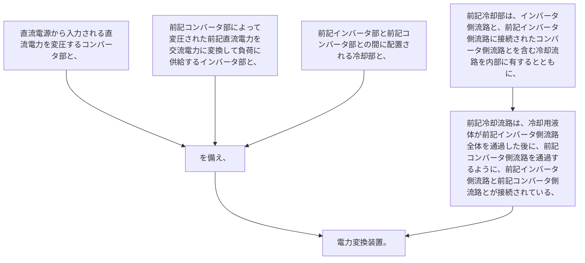

直流電源から入力される直流電力を変圧するコンバータ部と、
前記コンバータ部によって変圧された前記直流電力を交流電力に変換して負荷に供給するインバータ部と、
前記インバータ部と前記コンバータ部との間に配置される冷却部と、を備え、
前記冷却部は、インバータ側流路と、前記インバータ側流路に接続されたコンバータ側流路とを含む冷却流路を内部に有するとともに、
前記冷却流路は、冷却用液体が前記インバータ側流路全体を通過した後に、前記コンバータ側流路を通過するように、前記インバータ側流路と前記コンバータ側流路とが接続されている、電力変換装置。
