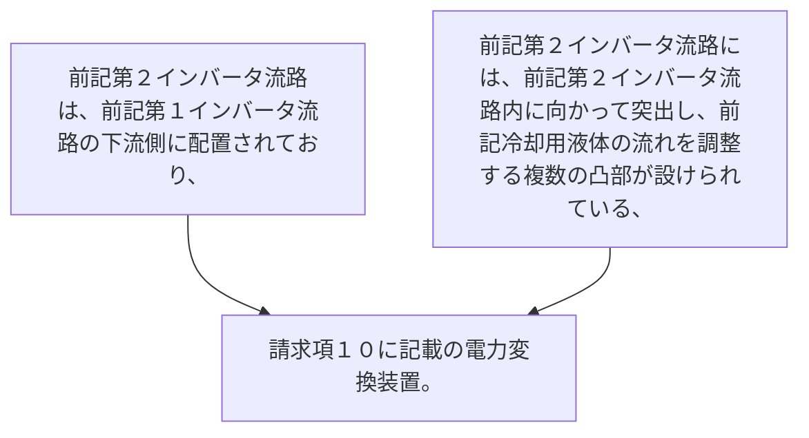

前記第２インバータ流路は、前記第１インバータ流路の下流側に配置されており、
前記第２インバータ流路には、前記第２インバータ流路内に向かって突出し、前記冷却用液体の流れを調整する複数の凸部が設けられている、請求項１０に記載の電力変換装置。

```mermaid
flowchart TD
A[前記第２インバータ流路は、前記第１インバータ流路の下流側に配置されており、]
B[前記第２インバータ流路には、前記第２インバータ流路内に向かって突出し、前記冷却用液体の流れを調整する複数の凸部が設けられている、]
C[請求項１０に記載の電力変換装置。]
A --> C
B --> C
```