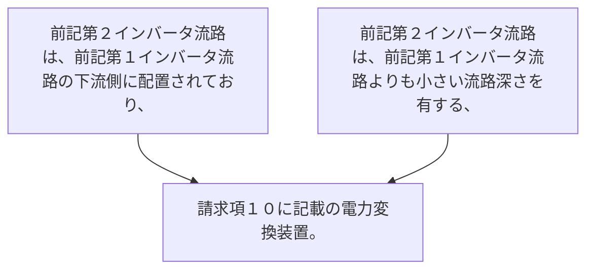

前記第２インバータ流路は、前記第１インバータ流路の下流側に配置されており、
前記第２インバータ流路は、前記第１インバータ流路よりも小さい流路深さを有する、請求項１０に記載の電力変換装置。

```mermaid
flowchart TD
A[前記第２インバータ流路は、前記第１インバータ流路の下流側に配置されており、]
B[前記第２インバータ流路は、前記第１インバータ流路よりも小さい流路深さを有する、]
C[請求項１０に記載の電力変換装置。]
A --> C
B --> C
```