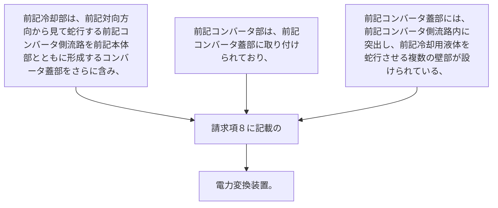

```mermaid
flowchart TD
A[前記冷却部は、前記対向方向から見て蛇行する前記コンバータ側流路を前記本体部とともに形成するコンバータ蓋部をさらに含み、]
B[前記コンバータ部は、前記コンバータ蓋部に取り付けられており、]
C[前記コンバータ蓋部には、前記コンバータ側流路内に突出し、前記冷却用液体を蛇行させる複数の壁部が設けられている、]
D[請求項８に記載の]
E[電力変換装置。]
A --> D
B --> D
C --> D
D --> E
```