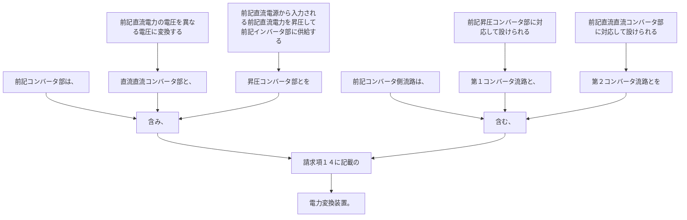

前記コンバータ部は、前記直流電力の電圧を異なる電圧に変換する直流直流コンバータ部と、前記直流電源から入力される前記直流電力を昇圧して前記インバータ部に供給する昇圧コンバータ部とを含み、
前記コンバータ側流路は、前記昇圧コンバータ部に対応して設けられる第１コンバータ流路と、前記直流直流コンバータ部に対応して設けられる第２コンバータ流路とを含む、請求項１４に記載の電力変換装置。

```mermaid
flowchart TD
A[前記コンバータ部は、]
B[前記直流電力の電圧を異なる電圧に変換する]
C[直流直流コンバータ部と、]
D[前記直流電源から入力される前記直流電力を昇圧して前記インバータ部に供給する]
E[昇圧コンバータ部とを]
F[含み、]
G[前記コンバータ側流路は、]
H[前記昇圧コンバータ部に対応して設けられる]
I[第１コンバータ流路と、]
J[前記直流直流コンバータ部に対応して設けられる]
K[第２コンバータ流路とを]
L[含む、]
M[請求項１４に記載の]
N[電力変換装置。]

A --> F
B --> C
D --> E
C --> F
E --> F

G --> L
H --> I
J --> K
I --> L
K --> L

F --> M
L --> M
M --> N
```