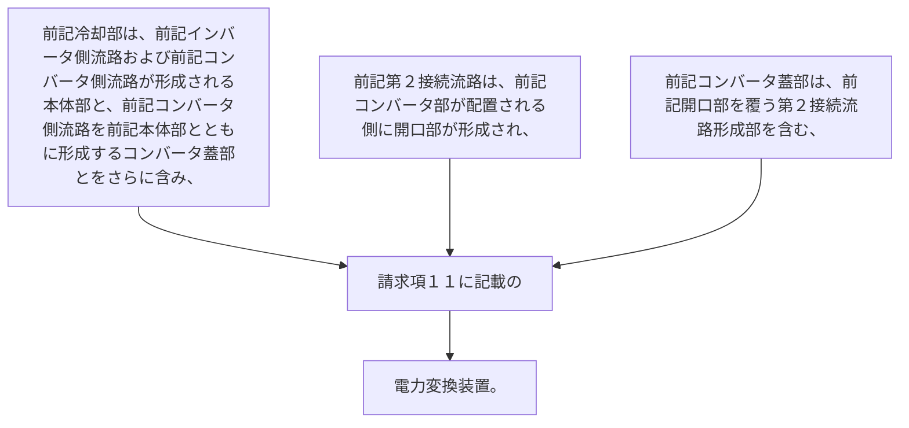

```mermaid
flowchart TD
A[前記冷却部は、前記インバータ側流路および前記コンバータ側流路が形成される本体部と、前記コンバータ側流路を前記本体部とともに形成するコンバータ蓋部とをさらに含み、]
B[前記第２接続流路は、前記コンバータ部が配置される側に開口部が形成され、]
C[前記コンバータ蓋部は、前記開口部を覆う第２接続流路形成部を含む、]
D[請求項１１に記載の]
E[電力変換装置。]
A --> D
B --> D
C --> D
D --> E
```