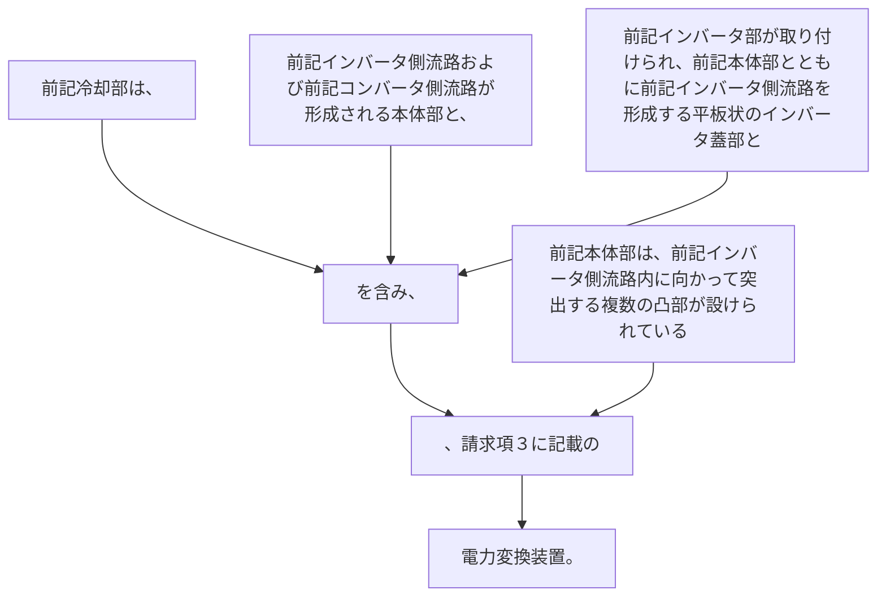

前記冷却部は、前記インバータ側流路および前記コンバータ側流路が形成される本体部と、前記インバータ部が取り付けられ、前記本体部とともに前記インバータ側流路を形成する平板状のインバータ蓋部とを含み、
前記本体部は、前記インバータ側流路内に向かって突出する複数の凸部が設けられている、請求項３に記載の電力変換装置。

```mermaid
flowchart TD
A[前記冷却部は、]
B[前記インバータ側流路および前記コンバータ側流路が形成される本体部と、]
C[前記インバータ部が取り付けられ、前記本体部とともに前記インバータ側流路を形成する平板状のインバータ蓋部と]
D[を含み、]
E[前記本体部は、前記インバータ側流路内に向かって突出する複数の凸部が設けられている]
F[、請求項３に記載の]
G[電力変換装置。]
A --> D
B --> D
C --> D
D --> F
E --> F
F --> G
```