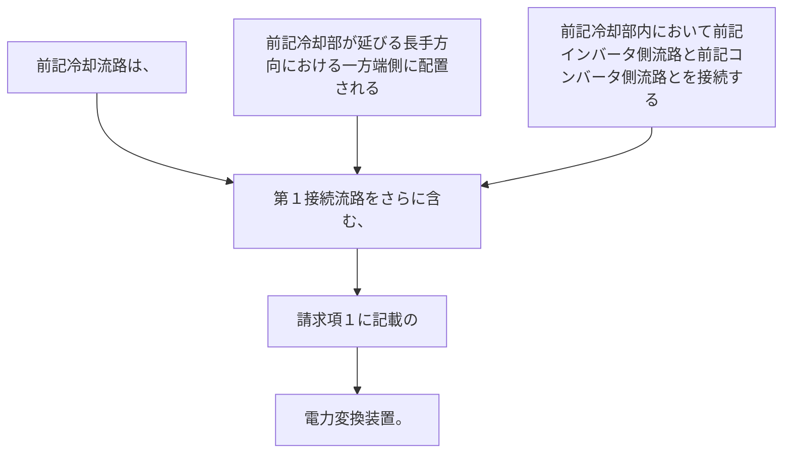

前記冷却流路は、前記冷却部が延びる長手方向における一方端側に配置されるとともに、前記冷却部内において前記インバータ側流路と前記コンバータ側流路とを接続する第１接続流路をさらに含む、請求項１に記載の電力変換装置。

```mermaid
flowchart TD
A[前記冷却流路は、]
B[前記冷却部が延びる長手方向における一方端側に配置される]
C[前記冷却部内において前記インバータ側流路と前記コンバータ側流路とを接続する]
D[第１接続流路をさらに含む、]
E[請求項１に記載の]
F[電力変換装置。]
A --> D
B --> D
C --> D
D --> E
E --> F
```