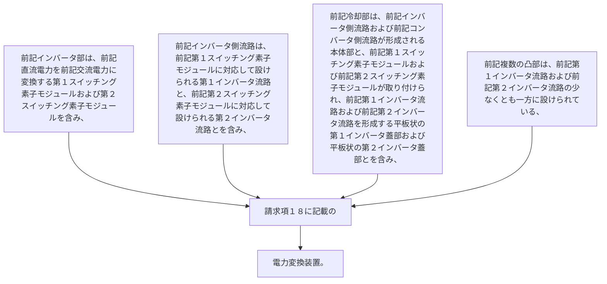

```mermaid
flowchart TD
A[前記インバータ部は、前記直流電力を前記交流電力に変換する第１スイッチング素子モジュールおよび第２スイッチング素子モジュールを含み、]
B[前記インバータ側流路は、前記第１スイッチング素子モジュールに対応して設けられる第１インバータ流路と、前記第２スイッチング素子モジュールに対応して設けられる第２インバータ流路とを含み、]
C[前記冷却部は、前記インバータ側流路および前記コンバータ側流路が形成される本体部と、前記第１スイッチング素子モジュールおよび前記第２スイッチング素子モジュールが取り付けられ、前記第１インバータ流路および前記第２インバータ流路を形成する平板状の第１インバータ蓋部および平板状の第２インバータ蓋部とを含み、]
D[前記複数の凸部は、前記第１インバータ流路および前記第２インバータ流路の少なくとも一方に設けられている、]
E[請求項１８に記載の]
F[電力変換装置。]
A --> E
B --> E
C --> E
D --> E
E --> F
```