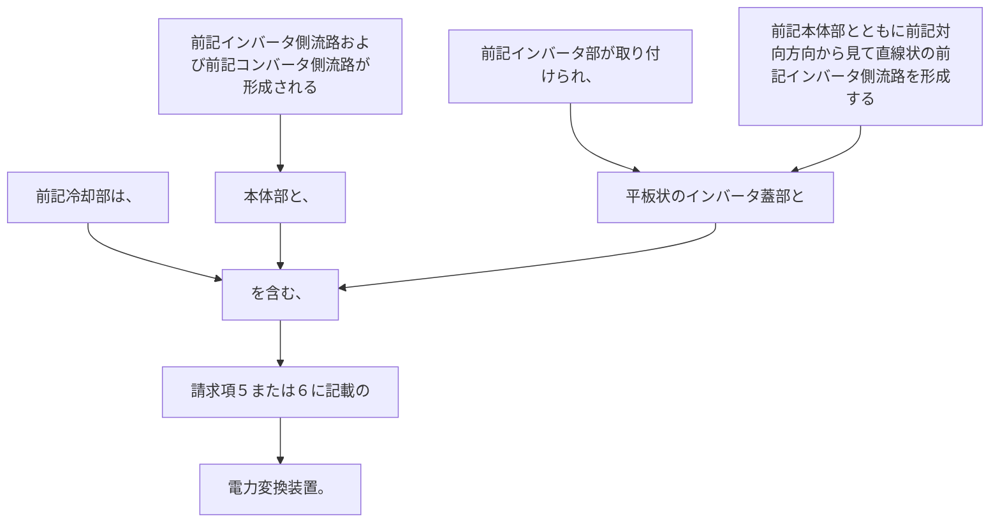

```mermaid
flowchart TD
A[前記冷却部は、]
B[前記インバータ側流路および前記コンバータ側流路が形成される]
C[本体部と、]
D[前記インバータ部が取り付けられ、]
E[前記本体部とともに前記対向方向から見て直線状の前記インバータ側流路を形成する]
F[平板状のインバータ蓋部と]
G[を含む、]
H[請求項５または６に記載の]
I[電力変換装置。]
A --> G
B --> C
C --> G
D --> F
E --> F
F --> G
G --> H
H --> I
```