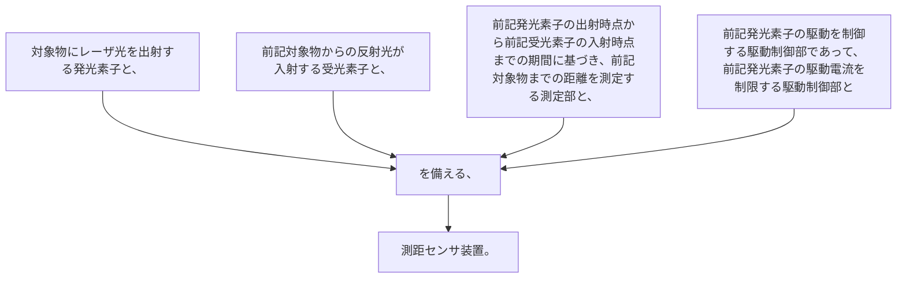

```mermaid
flowchart TD
A[対象物にレーザ光を出射する発光素子と、]
B[前記対象物からの反射光が入射する受光素子と、]
C[前記発光素子の出射時点から前記受光素子の入射時点までの期間に基づき、前記対象物までの距離を測定する測定部と、]
D[前記発光素子の駆動を制御する駆動制御部であって、前記発光素子の駆動電流を制限する駆動制御部と]
E[を備える、]
F[測距センサ装置。]
A --> E
B --> E
C --> E
D --> E
E --> F
```