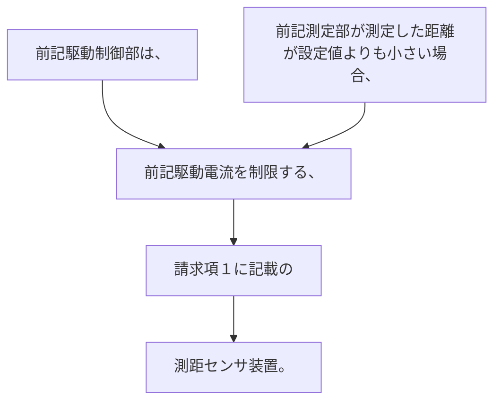

前記駆動制御部は、前記測定部が測定した距離が設定値よりも小さい場合、前記駆動電流を制限する、請求項１に記載の測距センサ装置。

```mermaid
flowchart TD
A[前記駆動制御部は、]
B[前記測定部が測定した距離が設定値よりも小さい場合、]
C[前記駆動電流を制限する、]
D[請求項１に記載の]
E[測距センサ装置。]
A --> C
B --> C
C --> D
D --> E
```