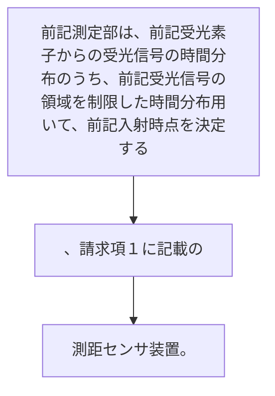

前記測定部は、前記受光素子からの受光信号の時間分布のうち、前記受光信号の領域を制限した時間分布用いて、前記入射時点を決定する、請求項１に記載の測距センサ装置。

```mermaid
flowchart TD
A[前記測定部は、前記受光素子からの受光信号の時間分布のうち、前記受光信号の領域を制限した時間分布用いて、前記入射時点を決定する]
B[、請求項１に記載の]
C[測距センサ装置。]
A --> B
B --> C
```