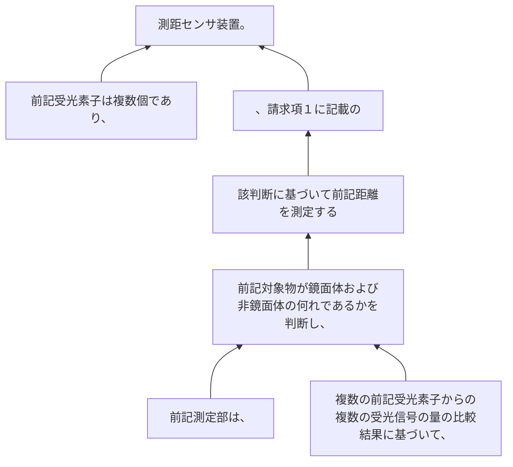

前記受光素子は複数個であり、
前記測定部は、複数の前記受光素子からの複数の受光信号の量の比較結果に基づいて、前記対象物が鏡面体および非鏡面体の何れであるかを判断し、該判断に基づいて前記距離を測定する、請求項１に記載の測距センサ装置。

```mermaid
flowchart BT
G[測距センサ装置。]
F[、請求項１に記載の]
E[該判断に基づいて前記距離を測定する]
D[前記対象物が鏡面体および非鏡面体の何れであるかを判断し、]
C[複数の前記受光素子からの複数の受光信号の量の比較結果に基づいて、]
B[前記測定部は、]
A[前記受光素子は複数個であり、]

A --> G
B --> D
C --> D
D --> E
E --> F
F --> G
```