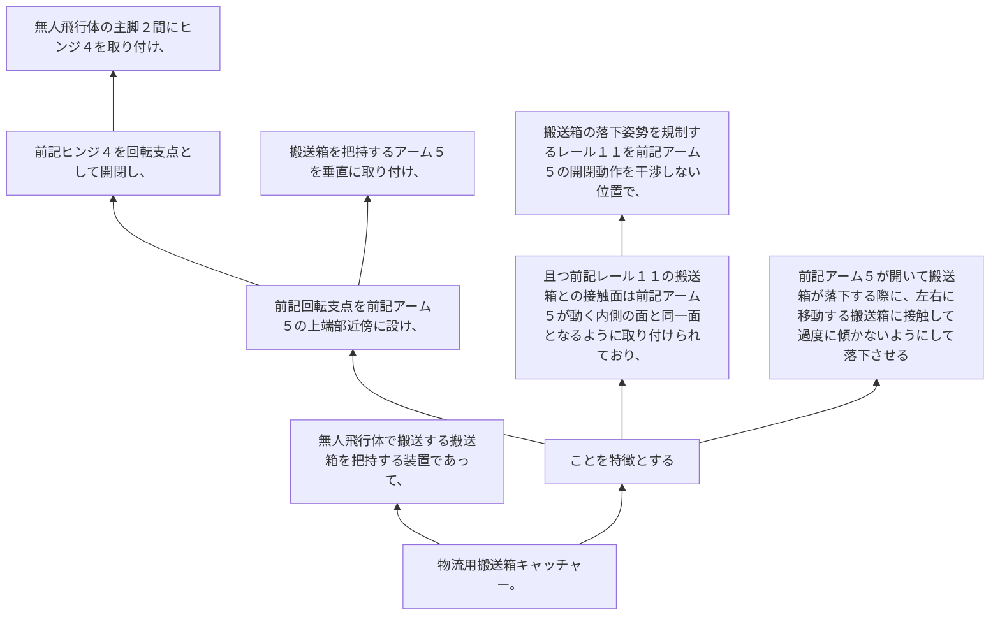

```mermaid
flowchart BT
A[無人飛行体で搬送する搬送箱を把持する装置であって、]
B[無人飛行体の主脚２間にヒンジ４を取り付け、]
C[前記ヒンジ４を回転支点として開閉し、]
D[搬送箱を把持するアーム５を垂直に取り付け、]
E[前記回転支点を前記アーム５の上端部近傍に設け、]
F[搬送箱の落下姿勢を規制するレール１１を前記アーム５の開閉動作を干渉しない位置で、]
G[且つ前記レール１１の搬送箱との接触面は前記アーム５が動く内側の面と同一面となるように取り付けられており、]
H[前記アーム５が開いて搬送箱が落下する際に、左右に移動する搬送箱に接触して過度に傾かないようにして落下させる]
I[ことを特徴とする]
J[物流用搬送箱キャッチャー。]
J --> A
J --> I
I --> E
I --> G
I --> H
E --> C
E --> D
C --> B
G --> F
```