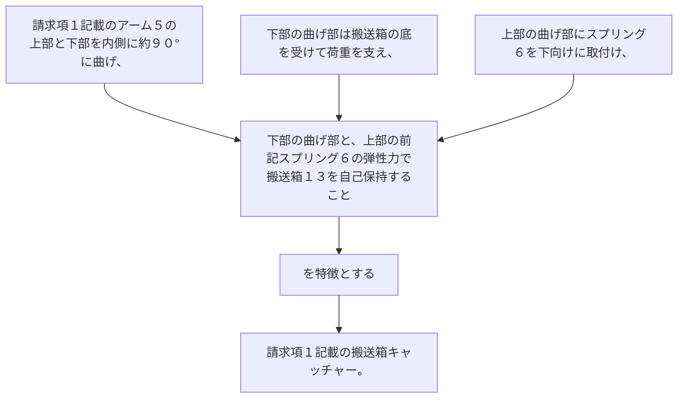

請求項１記載のアーム５の上部と下部を内側に約９０°に曲げ、下部の曲げ部は搬送箱の底を受けて荷重を支え、上部の曲げ部にスプリング６を下向けに取付け、下部の曲げ部と、上部の前記スプリング６の弾性力で搬送箱１３を自己保持することを特徴とする請求項１記載の搬送箱キャッチャー。

```mermaid
flowchart TD
A[請求項１記載のアーム５の上部と下部を内側に約９０°に曲げ、]
B[下部の曲げ部は搬送箱の底を受けて荷重を支え、]
C[上部の曲げ部にスプリング６を下向けに取付け、]
D[下部の曲げ部と、上部の前記スプリング６の弾性力で搬送箱１３を自己保持すること]
E[を特徴とする]
F[請求項１記載の搬送箱キャッチャー。]
A --> D
B --> D
C --> D
D --> E
E --> F
```