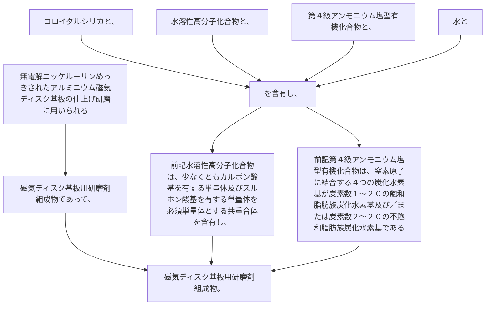

無電解ニッケル－リンめっきされたアルミニウム磁気ディスク基板の仕上げ研磨に用いられる磁気ディスク基板用研磨剤組成物であって、
コロイダルシリカと、
水溶性高分子化合物と、
第４級アンモニウム塩型有機化合物と、
水と
を含有し、
前記水溶性高分子化合物は、
少なくともカルボン酸基を有する単量体及びスルホン酸基を有する単量体を必須単量体とする共重合体を含有し、
前記第４級アンモニウム塩型有機化合物は、
窒素原子に結合する４つの炭化水素基が炭素数１～２０の飽和脂肪族炭化水素基及び／または炭素数２～２０の不飽和脂肪族炭化水素基である磁気ディスク基板用研磨剤組成物。
